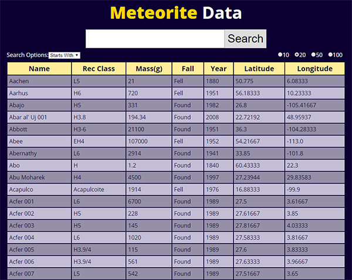

# Meteorite Data Lookup App
By Carlos Fins

## Live Project
Demo of the project can be found here: [Meteorite Data](https://clockwerkz.github.io/meteoriteData)

## Project Info

This project was completed for the initial Pre-Work requirements for the Chingu Cohort Voyage #9. We were provided an endpoint with Meteorite Landing data, and were tasked with creating a front end project to look up and display the data.  
This project was built using React, utilizing React Hooks for state managment. I made use of the endpoint's ability to use offset values when fetching for data to create pagination in the returned results. The state keeps track of what has been fetched, and what "page" it is on.  
In addition, I provided a way to select the desired set size of the results, and also offer two search options: Searches that start with a search query, or that contain a string/substring search query.

## Installation and Dependencies
In order to install, simply clone or download the project by pressing the green *Clone Or Download* button above. 
Once downloaded, run npm install from the root of the project folder.
**Node** and **NPM** are required in order to build/run the project locally.

## Licensing
This project is licensed under the Creative Commons Licensing. You are free to:

* Share - copy and redistribute the matertial in any medium or format

* Adapt - remix, transform, and build upon the material for any purpose, even commercially. 